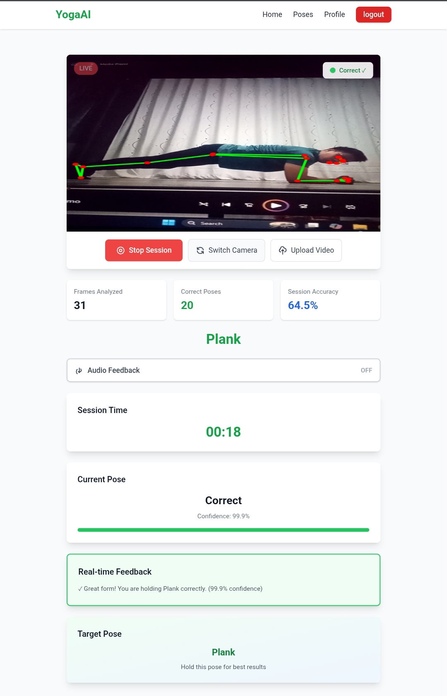

# 🧘‍♂️ YogaAI – Real-Time Yoga Pose Detection & Feedback Web App

YogaAI is a real-time AI-powered web application that detects yoga poses using a **webcam or uploaded video** and provides **instant posture feedback** based on a trained machine learning model.

This repository contains the **web application (frontend + backend integration)**.  
The **ML training code and model development** are maintained in a separate repository:

👉 **ML Repository:** [github.com/aayush-12321/YogAI_Project](https://github.com/aayush-12321/YogAI_Project/tree/feature1)

---

## 📸 Demo



---

## 🚀 Features

- 🎥 Real-time pose detection using webcam
- 🤖 XGBoost multi-class classification model
- 🧍 Pose confidence score
- ⚠️ Incorrect posture feedback
- 📊 Evaluation using confusion matrix, feature importance, learning curve, and 5-fold cross-validation
- 🔊 Voice guidance (Text-to-Speech)
- 🧾 Session-based feedback tracking

---

## 🧠 Supported Yoga Poses

- Mountain Pose (Tadasana – Arms Down)
- Warrior II
- Plank

---

## 🏗️ System Architecture

```
Webcam → MediaPipe Pose → Angle Feature Extraction →
Trained XGBoost Model → Pose Classification →
Real-time Feedback → Frontend Display
```

---


## ⚙️ Tech Stack

**Frontend:** HTML, CSS, JavaScript

**Backend:** Django , OpenCV, MediaPipe

**Machine Learning:** XGBoost, NumPy, Pandas

---

## 🧪 Model Details

| Parameter | Value |
|---|---|
| Algorithm | XGBoost (Multi-class classifier) |
| Train/Test Split | 80/20 |
| Validation | 5-Fold Cross-Validation |
| Features | Joint angle–based biomechanical features |


For the full training pipeline, feature engineering, and experiments, see the ML repository:  
👉 [github.com/aayush-12321/YogAI_Project](https://github.com/aayush-12321/YogAI_Project/tree/feature1)

---

## ▶️ How to Run Locally

**1. Clone the repository**

```bash
git clone https://github.com/aayush-12321/yoga-ai-webapp.git
cd yoga-ai-webapp
```

**2. Install dependencies**

```bash
pip install -r Requirements.txt
```

**3. Run the backend server**

```bash
python manage.py runserver
```

**4. Open in browser**

```
http://127.0.0.1:8000
```

Allow webcam access when prompted.
